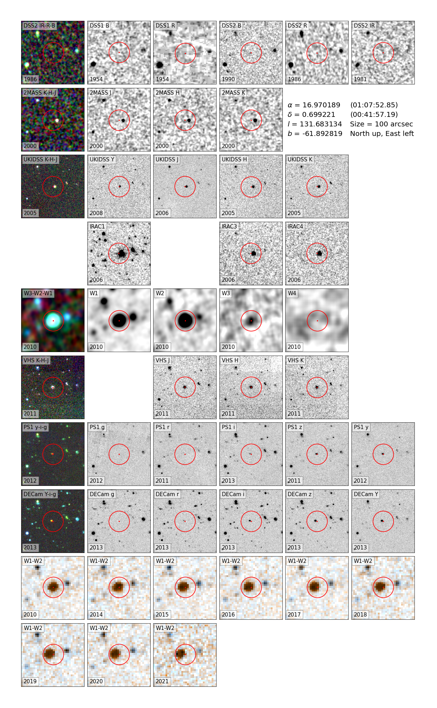
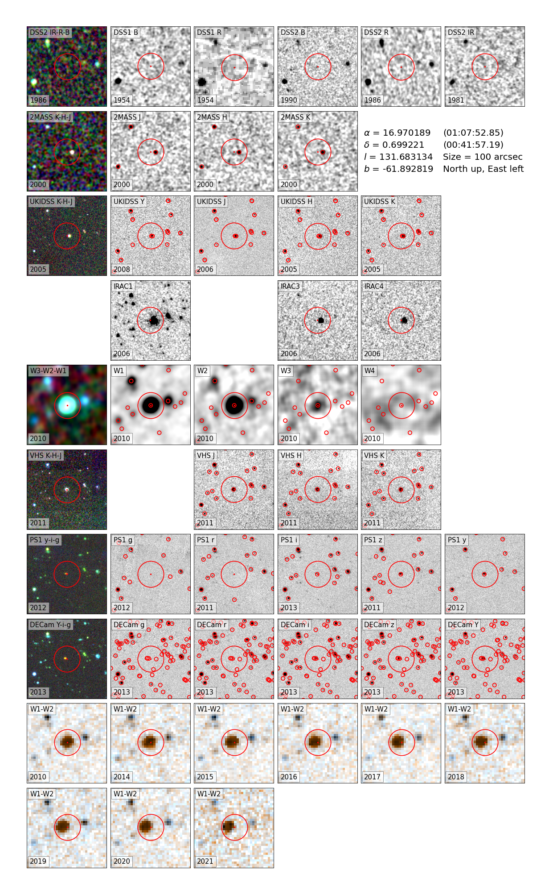

# Finder_charts

[](http://www.astropy.org/)

<a href="https://ascl.net/2210.004"></a>

 ```Finder_charts``` is a Python module to create multi-bands finder charts from image data of following sky surveys:
- DSS (DSS1 B, DSS1 R, DSS2 B, DSS2 R, DSS2 IR),
- 2MASS (J, H, K),
- Spitzer (IRAC1, IRAC2, IRAC3, IRAC4, MIPS24),
- WISE (W1, W2, W3, W4),
- UKIDSS (Y, J, H, K),
- UHS (J, K),
- VHS (Y, J, H, K),
- VVV (Z, Y, J, H, K),
- VIKING (Z, Y, J, H, K),
- Pan-STARRS (g, r, i, z, y),
- DECam (g, r, i, z, Y).

It also creates a WISE time series of epochs 2010, (2013), and 2014-2021.

All images are reprojected so that north is up and east is to the left (except for some surveys at high declination).

The ```create_finder_charts``` function only takes two mandatory arguments, RA and Dec in decimal degrees, which can be specified either as a scalar, Python sequence (list, tuple, ...), or Numpy array.

This is a minimal usage example:
```python
from Finder_charts import create_finder_charts
create_finder_charts(16.9701886, 0.6992208)
```

The resulting finder charts are saved to the directory given by parameter ```directory``` and automatically opened if ```open_file``` is set to True.
Catalog search results can be saved to the same directory by setting ```save_result_tables``` to True.
This creates one file per catalog search results, e.g. Finder_charts_2MASS_results_16.970189+0.699221.dat :
```
|    _r|   RAJ2000|   DEJ2000|errMaj|errMin|errPA|          _2MASS|  Jmag|Jcmsig|e_Jmag|      Jsnr|  Hmag|Hcmsig|e_Hmag|      Hsnr|  Kmag|Kcmsig|e_Kmag|      Ksnr|Qflg|Rflg|Bflg|Cflg|  Ndet|  prox|pxPA|    pxCntr|Xflg|Aflg|      Cntr|Hemis|      Date|Scan|   GLON|   GLAT| Xscan|    _tab1_36|Jpsfchi|Hpsfchi|Kpsfchi|Jstdap|e_Jstdap|Hstdap|e_Hstdap|Kstdap|e_Kstdap|edgeNS|edgeEW|edge| dup| use| opt|  Dopt|PAopt| Bmag| Rmag|Nopt|extKey|scanKey|coaddKey|coadd| Opt|
|double|    double|    double| float| float|  int|            char| float| float| float|    double| float| float| float|    double| float| float| float|    double|char|char|char|char|  char| float| int|      long| int| int|      long| char|      char| int| double| double| float|      double|  float|  float|  float| float|   float| float|   float| float|   float|  long|   int|char| int| int|char| float|  int|float|float| int|  long|   long|    long|  int|char|
|      |       deg|       deg|arcsec|arcsec|  deg|                |   mag|   mag|   mag|          |   mag|   mag|   mag|          |   mag|   mag|   mag|          |    |    |    |    |      |arcsec| deg|          |    |    |          |     |          |    |    deg|    deg|arcsec|           d|       |       |       |   mag|     mag|   mag|     mag|   mag|     mag|arcsec|arcsec|    |    |    |    |arcsec|  deg|  mag|  mag|    |      |       |        |     |    |
|  null|      null|      null|  null|  null| null|            null|  null|  null|  null|      null|  null|  null|  null|      null|  null|  null|  null|      null|null|null|null|null|  null|  null|null|      null|null|null|      null| null|      null|null|   null|   null|  null|        null|   null|   null|   null|  null|    null|  null|    null|  null|    null|  null|  null|null|null|null|null|  null| null| null| null|null|  null|   null|    null| null|null|
  6.422  16.968425   0.698999   0.12   0.06     0 01075242+0041563 15.824  0.057  0.058       20.8 14.512  0.038  0.039       30.8 13.709  0.043  0.044       33.0  AAA  222  111  000 365555   44.1   44 1229286793    0    0 1229286809     s 2000-09-02   86 131.679 -61.893 -161.7 2451789.7336    1.13    1.19    0.70 15.898    0.099 14.673    0.086 13.682    0.023   2536     90   se    0    1    0   null  null  null  null    0   null   66111  1520551   245  Opt
 39.277  16.976971   0.707773   0.15   0.11     1 01075447+0042279 16.235  0.094  0.095       14.2 15.516  0.082  0.082       12.2 15.443  0.156  0.156        6.7  AAC  222  111  000 160606   44.1  224 1229286809    0    0 1229286793     s 2000-09-02   86 131.695 -61.883 -192.5 2451789.7336    1.23    0.88    1.66 16.086    0.167 15.509    0.210 15.105    0.216   2568     59   se    1    1    0   null  null  null  null    0   null   66111  1520551   245  Opt
 44.163  16.981315   0.694039   0.30   0.25     5 01075551+0041385 16.450  0.093  0.094       11.7 15.878  0.142  0.142        8.8 15.739  0.223  0.223        5.1  ABD  222  111  000 060605   49.7  291 1229286809    0    0 1229286817     s 2000-09-02   86 131.708 -61.896 -208.1 2451789.7336    0.93    0.75    0.91 16.591    0.263 15.879    0.285 15.761    0.258   2518     44   se    1    1    U    0.4   266 18.10 17.40    1   null   66111  1520551   245  Opt
```

### Module dependencies:
The Python Standard Library, numpy, matplotlib, pillow (PIL fork), requests, astropy, astroquery, reproject and tqdm.  
``Finder_charts`` has been developed with following dependency versions:
```
numpy==1.26.2
matplotlib==3.8.0
pillow==10.0.1
requests==2.31.0
astropy==5.3.4
astroquery==0.4.7.dev9008
reproject==0.13.0
tqdm==4.65.0
```

### Installation:
The code can be installed as follows:
```
git clone https://github.com/fkiwy/Finder_charts.git
cd Finder_charts
python setup.py install
```

### Parameter description:
- ```ra``` : right ascension in decimal degrees (type: float)
- ```dec``` : declination in decimal degrees (type: float)
- ```img_size``` : image size in arcseconds (type: int, default: 100)
- ```overlays``` : whether to plot catalog overlays (type: bool, default: False)
- ```overlay_color``` : catalog overlay color (type: str, default: 'red')
- ```dss``` : whether to create DSS image series (type: bool, default: True)
- ```twomass``` : whether to create 2MASS image series (type: bool, default: True)
- ```spitzer``` : whether to create Spitzer image series (type: bool, default: True)
- ```wise``` : whether to create WISE image series (type: bool, default: True)
- ```ukidss``` : whether to create UKIDSS image series (type: bool, default: True)
- ```uhs``` : whether to create UHS image series (type: bool, default: True)
- ```vhs``` : whether to create VHS image series (type: bool, default: True)
- ```vvv``` : whether to create VVV image series (type: bool, default: True)
- ```viking``` : whether to create VIKING image series (type: bool, default: True)
- ```ps1``` : whether to create Pan-STARRS image series (type: bool, default: True)
- ```decam``` : whether to create DECam image series (type: bool, default: True)
- ```neowise``` : whether to create WISE time series (type: bool, default: True)
- ```neowise_contrast``` : WISE time series contrast (type: int, default: 3)
- ```gaia_images``` : whether to create simulated Gaia image series (type: bool, default: False)
- ```gaia_entries``` :  whether to plot Gaia catalog overlays (type: bool, default: False)
- ```gaia_pm_vectors``` :  whether to plot Gaia porper motion vectors (type: bool, default: False)
- ```gaia_pm_years``` : the number of years to scale the proper motion vectors (type: int, default: 10)
- ```gaia_color``` : Gaia overlay color (type: str, default: 'green')
- ```targets``` : a list of targets to be plotted on the specified image series/survey (type: list of Finder_charts.Target objects, default: None)
```python
  targets = [
      Target(catalog='2MASS', epoch=2000.5, ra=0.123, dec=0.123, marker_size=10, marker_color='red', survey=Survey.TWO_MASS),
      Target(catalog='AllWISE', epoch=2010.6, ra=1.234, dec=1.234, marker_size=9, marker_color='blue', survey=Survey.ALLWISE),
      ...
  ]
```
where ``catalog`` is the catalog label and ``survey`` is of type Finder_charts.Survey
- ```pmra``` : proper motion in RA (mas/yr) used to propagate the crosshair position to the appropriate survey epoch (type: float, default: None)
- ```pmdec``` : proper motion in declination (mas/yr) used to propagate the crosshair position to the appropriate survey epoch (type: float, default: None)
- ```ref_epoch``` :  epoch of ``ra`` and ``dec`` used to propagate the crosshair position to the appropriate survey epoch (type: astropy.time.Time, default: None)
- ```crosshair_type``` : the shape of the crosshair (type: Finder_charts.Crosshair, default: Crosshair.CIRCLE_DOT)
- ```propagate_gaia_positions``` : whether to propagate the Gaia catalog positions to the appropriate survey epoch (type: bool, default: False)
- ```chrono_order``` : whether to plot image series in chronological order (type: bool, default: True)
- ```object_info``` : whether to plot object information like coordinates, etc. (type: bool, default: True)
- ```directory``` : directory where the finder charts should be saved (type: str, default: tempfile.gettempdir())
- ```cache``` : whether to cache the downloaded files (type: bool, default: True)
- ```show_progress``` : whether to show the file download progress (type: bool, default: True)
- ```timeout``` : timeout for remote requests in seconds (type: int, default: 300)
- ```open_pdf``` : deprecated, replaced by ```open_file```
- ```open_file``` : whether to open the saved finder charts automatically (type: bool, default: True)
- ```file_format``` : output file format: pdf, png, eps, etc. (type: str, default: 'pdf')
- ```save_result_tables``` : whether to save the catalog search result tables to the specified directory (type: bool, default: False)
- ```result_tables_format``` : catalog search result tables output format (type: str, default: 'ipac')
- ```result_tables_extension``` : catalog search result tables file extension (type: str, default: 'dat')

### Example output:

#### Same output with catalog overlays:


Here's a more advanced example with propagated crosshairs and Gaia positions plus proper motion vectors:
```python
from Finder_charts import create_finder_charts, Crosshair, Survey, Target
from astropy.time import Time
import tempfile

ra, dec = 152.9226066, 28.7632385
pmra, pmdec = -124.825, -713.244
ref_epoch = Time(2016.0, format='jyear')

create_finder_charts(ra, dec, img_size=100, overlays=True, overlay_color='red', dss=True, twomass=True, spitzer=True, wise=True,
                     ukidss=True, uhs=True, vhs=True, vvv=True, viking=True, ps1=True, decam=True, neowise=True, neowise_contrast=5,
                     gaia_images=True, gaia_entries=True, gaia_pm_vectors=True, gaia_pm_years=50, gaia_color='green', targets=None,
                     pmra=pmra, pmdec=pmdec, ref_epoch=ref_epoch, crosshair_type=Crosshair.CROSS_NO_CENTER, propagate_gaia_positions=True,
                     chrono_order=True, object_info=True, directory=tempfile.gettempdir(), cache=True, show_progress=True, timeout=300,
                     open_file=True, file_format='png', save_result_tables=True, result_tables_format='ipac', result_tables_extension='dat')
```
