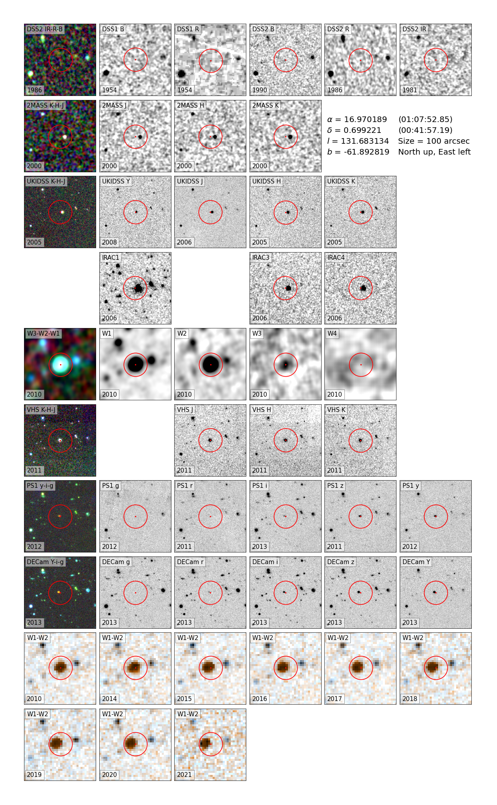
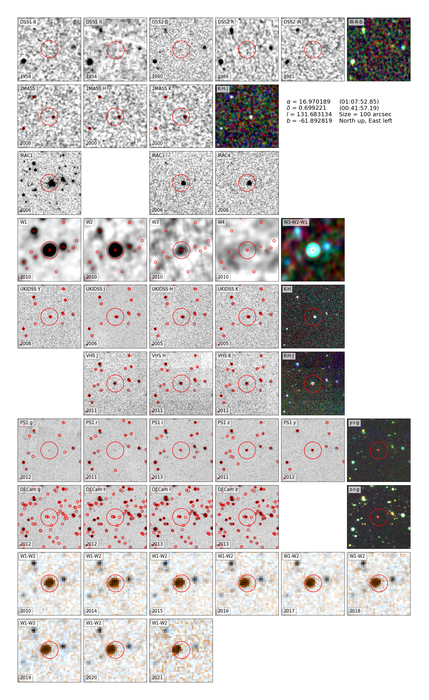

# Finder_charts

[](https://doi.org/10.5281/zenodo.7097859)

Finder_chatrs is a Python module to create finder charts from image data of following sky surveys:
- DSS (DSS1 B, DSS1 R, DSS2 B, DSS2 R, DSS2 IR),
- 2MASS (J,H,K),
- Spitzer (IRAC1, IRAC2, IRAC3, IRAC4, MIPS24),
- WISE (W1, W2, W3, W4),
- UKIDSS (Y, J, H, K),
- UHS (J),
- VHS (Y, J, H, K),
- Pan-STARRS (g, r, i, z, y),
- DECam (g, r, i, z, Y).

It also creates a WISE time series of epochs 2010, (2013), and 2014-2021.

The code only takes two mandatory arguments, RA and Dec in decimal degrees, which can be specified either as a scalar, Python sequence (list, tuple, ...), or Numpy array.

This is a minimal usage example:
```
from Finder_charts import create_finder_charts
create_finder_charts(16.9701886, 0.6992208)
```

Parameter description:
- ```ra``` : right ascension in decimal degrees (type: float)
- ```dec``` : declination in decimal degrees (type: float)
- ```img_size``` : image size in arcseconds (type: int, default: 100 arcsec)
- ```overlays``` : whether to plot catalog overlays (type: bool, default: False)
- ```overlay_color``` : catalog overlay color (type: str, default: 'red')
- ```dss``` : whether to create DSS image series (type: bool, default: True)
- ```twomass``` : whether to create 2MASS image series (type: bool, default: True)
- ```spitzer``` : whether to create Spitzer image series (type: bool, default: True)
- ```wise``` : whether to create WISE image series (type: bool, default: True)
- ```ukidss``` : whether to create UKIDSS image series (type: bool, default: True)
- ```vhs``` : whether to create VHS image series (type: bool, default: True)
- ```ps1``` : whether to create Pan-STARRS image series (type: bool, default: True)
- ```decam``` : whether to create DECam image series (type: bool, default: True)
- ```neowise``` : whether to create WISE time series (type: bool, default: True)
- ```neowise_contrast``` : WISE time series contrast (type: int, default: 3)
- ```directory``` : output directory for the resulting PDF files (type: str, default: system temp directory)
- ```cache``` : whether to cache the downloaded files (type: bool, default: True)
- ```show_progress``` : whether to show the file download progress (type: bool, default: True)
- ```timeout``` : timeout for remote requests in seconds (type: int, default: 300 sec)
- ```open_pdf``` : whether to open the saved result PDF file(s) (type: bool, default: True)

Example output:


With catalog overlays:

